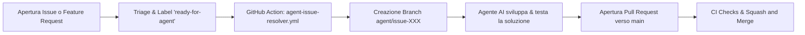

# Automazione degli Agenti e Risoluzione Automatica Issue

Questa guida spiega come è strutturata l'automazione per la risoluzione automatica di Issue e Feature Request tramite agenti AI in **agentic-coding-lab**.

---

## 1. Panoramica del Flusso di Lavoro

L'automazione si basa su un flusso semplice e controllato (Human-in-the-loop / Triage-driven):



1. **Apertura dell'Issue**: Uno sviluppatore o utente apre una segnalazione di bug o una feature request.
2. **Triage (`ready-for-agent`)**: Viene applicata l'etichetta `ready-for-agent` per indicare che la descrizione è chiara, completa e pronta per essere eseguita da un agente autonomo.
3. **Trigger GitHub Action**: Il workflow `.github/workflows/agent-issue-resolver.yml` intercetta l'evento, commenta la issue per confermare la presa in carico e predispone i requisiti per l'agente (es. tagging di `@copilot`, branch di destinazione `agent/issue-<numero>`).
4. **Sviluppo dell'Agente**: L'agente (Copilot Cloud Agent, Copilot CLI, Claude Code o script CI) legge il contesto, implementa il codice seguendo le skill (`skills/tdd/`, `skills/codebase-design/`) e verifica i test.
5. **Pull Request**: Viene aperta una PR intitolata con il riferimento all'issue (es. `feat: resolve issue #42 - Closes #42`).
6. **Squash & Merge**: Dopo la revisione e il passaggio dei check di CI, la PR viene fusa su `main` tramite **Squash and Merge**.

---

## 2. Configurazione Necessaria su GitHub (Step-by-Step)

Per far funzionare correttamente l'automazione, le GitHub Actions e l'auto-assegnazione al Copilot Coding Agent:

### A. Permessi di GitHub Actions nel Repository

1. Vai su **Settings** del repository su GitHub.
2. Nel menu a sinistra, seleziona **Actions** $\rightarrow$ **General**.
3. Scorri fino a **Workflow permissions**:
   - Seleziona **Read and write permissions**.
   - Spunta la casella **Allow GitHub Actions to create and approve pull requests**.
4. Clicca su **Save**.

### B. Configurazione del Personal Access Token (`COPILOT_PAT`) per Auto-Assegnazione

GitHub Copilot Coding Agent richiede un token licenziato per essere invocato automaticamente via API/Actions:

1. Vai su **GitHub Settings** $\rightarrow$ **Developer Settings** $\rightarrow$ **Personal access tokens** $\rightarrow$ **Fine-grained tokens** (oppure [github.com/settings/tokens?type=beta](https://github.com/settings/tokens?type=beta)).
2. Clicca su **Generate new token**:
   - **Name**: `COPILOT_ISSUE_ASSIGNER`
   - **Repository access**: *Only select repositories* $\rightarrow$ seleziona `agentic-coding-lab`.
   - **Permissions (Repository)**:
     - `Issues`: **Read and write**
     - `Pull requests`: **Read and write**
3. Copia il token generato (`github_pat_...`).
4. Nel repository `agentic-coding-lab`, vai su **Settings** $\rightarrow$ **Secrets and variables** $\rightarrow$ **Actions**.
5. Clicca **New repository secret**:
   - **Name**: `COPILOT_PAT`
   - **Secret**: incolla il token appena creato.
6. Clicca **Add secret**.

### C. Creazione dell'Etichetta `ready-for-agent`

1. Vai nella scheda **Issues** $\rightarrow$ **Labels**.
2. Se non esiste già, crea una nuova label:
   - **Name**: `ready-for-agent`
   - **Color**: `#0E8A16` (verde)
   - **Description**: `Issue specificata e pronta per essere presa in carico da un agente AI`

### D. Impostazioni di Squash and Merge

1. Vai su **Settings** $\rightarrow$ **General**.
2. Scorri fino alla sezione **Pull Requests**:
   - Spunta solo **Allow squash merging**.
   - Deseleziona *Allow merge commits* e *Allow rebase merging*.
   - Abilita **Automatically delete head branches**.

---

## 3. Modalità di Esecuzione per gli Agenti

In base agli strumenti abilitati sul tuo account/organizzazione:

- **GitHub Copilot Coding Agent (Cloud / Web)**: Assegnando l'issue o menzionando `@copilot`, Copilot in GitHub avvia la sessione cloud per generare la soluzione e aprire la PR.
- **Agent CLI Locale (Copilot CLI / Claude Code)**: Lo sviluppatore può lanciare la CLI indicando il numero dell'issue:

  ```bash
  gh issue view <numero>
  git checkout -b agent/issue-<numero>
  # L'agente lavora, testa e crea la PR:
  gh pr create --fill
  ```

- **Custom Runner / CI Action**: Il workflow richiama il modulo `scripts/dispatch-agent.mjs` che gestisce la logica di notifica e formattazione con supporto `--dry-run` per i test locali:

  ```bash
  # Test locale del dispatcher in modalità dry-run
  node scripts/dispatch-agent.mjs --issue 42 --title "Esempio task" --dry-run
  ```
