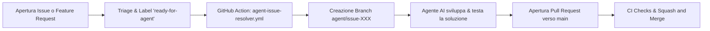

# Automazione degli Agenti e Risoluzione Automatica Issue

Questa guida spiega come è strutturata l'automazione per la risoluzione automatica di Issue e Feature Request tramite agenti AI in **agentic-coding-lab**.

---

## 1. Panoramica del Flusso di Lavoro

L'automazione si basa su un flusso semplice e controllato (Human-in-the-loop / Triage-driven):



1. **Apertura dell'Issue**: Uno sviluppatore o utente apre una segnalazione di bug o una feature request.
2. **Triage (`ready-for-agent`)**: Viene applicata l'etichetta `ready-for-agent` per indicare che la descrizione è chiara, completa e pronta per essere eseguita da un agente autonomo.
3. **Trigger GitHub Action**: Il workflow `.github/workflows/agent-issue-resolver.yml` intercetta l'evento, commenta la issue per confermare la presa in carico e predispone i requisiti per l'agente (es. tagging di `@copilot`, branch di destinazione `agent/issue-<numero>`).
4. **Sviluppo dell'Agente**: L'agente (Copilot Cloud Agent, Copilot CLI, Claude Code o script CI) legge il contesto, implementa il codice seguendo le skill (`skills/tdd/`, `skills/codebase-design/`) e verifica i test.
5. **Pull Request**: Viene aperta una PR intitolata con il riferimento all'issue (es. `feat: resolve issue #42 - Closes #42`).
6. **Squash & Merge**: Dopo la revisione e il passaggio dei check di CI, la PR viene fusa su `main` tramite **Squash and Merge**.

---

## 2. Configurazione Necessaria su GitHub (Step-by-Step)

Per far funzionare correttamente l'automazione, le GitHub Actions e l'auto-assegnazione al Copilot Coding Agent:

### A. Permessi di GitHub Actions nel Repository

1. Vai su **Settings** del repository su GitHub.
2. Nel menu a sinistra, seleziona **Actions** $\rightarrow$ **General**.
3. Scorri fino a **Workflow permissions**:
   - Seleziona **Read and write permissions**.
   - Spunta la casella **Allow GitHub Actions to create and approve pull requests**.
4. Clicca su **Save**.

### B. Configurazione del Personal Access Token (`COPILOT_PAT`) per Auto-Assegnazione

GitHub Copilot Coding Agent richiede un token licenziato per essere invocato automaticamente via API/Actions:

1. Vai su **GitHub Settings** $\rightarrow$ **Developer Settings** $\rightarrow$ **Personal access tokens** $\rightarrow$ **Fine-grained tokens** (oppure [github.com/settings/tokens?type=beta](https://github.com/settings/tokens?type=beta)).
2. Clicca su **Generate new token**:
   - **Name**: `COPILOT_ISSUE_ASSIGNER`
   - **Repository access**: *Only select repositories* $\rightarrow$ seleziona `agentic-coding-lab`.
   - **Permissions (Repository)**:
     - `Issues`: **Read and write**
     - `Pull requests`: **Read and write**
3. Copia il token generato (`github_pat_...`).
4. Nel repository `agentic-coding-lab`, vai su **Settings** $\rightarrow$ **Secrets and variables** $\rightarrow$ **Actions**.
5. Clicca **New repository secret**:
   - **Name**: `COPILOT_PAT`
   - **Secret**: incolla il token appena creato.
6. Clicca **Add secret**.

### C. Creazione dell'Etichetta `ready-for-agent`

1. Vai nella scheda **Issues** $\rightarrow$ **Labels**.
2. Se non esiste già, crea una nuova label:
   - **Name**: `ready-for-agent`
   - **Color**: `#0E8A16` (verde)
   - **Description**: `Issue specificata e pronta per essere presa in carico da un agente AI`

### D. Impostazioni di Squash and Merge e Gestione PR Draft

1. Vai su **Settings** $\rightarrow$ **General**.
2. Scorri fino alla sezione **Pull Requests**:
   - Spunta solo **Allow squash merging**.
   - Deseleziona *Allow merge commits* e *Allow rebase merging*.
   - Abilita **Automatically delete head branches**.

> **Nota su Draft / WIP Pull Requests**:
> Le pipeline di validazione CI (`ci.yml`) e conformità PR (`pr-compliance.yml`) sono configurate per ignorare le PR in stato **Draft**. I controlli si attivano automaticamente quando la PR viene contrassegnata come pronta per la revisione (*Ready for review*).

---

## 3. Modalità di Esecuzione per gli Agenti

In base agli strumenti abilitati sul tuo account/organizzazione e alle label assegnate all'issue:

### A. Esecuzione Dedicata su Local Self-Hosted Runner con Worktree Isolation

Il workflow `.github/workflows/agent-issue-resolver.yml` esegue tutti i task contrassegnati con `ready-for-agent` direttamente sul runner self-hosted locale (`runs-on: self-hosted`):

- **Isolamento Worktree**: Ogni issue viene elaborata in una cartella isolata `.worktrees/issue-<numero>`, permettendo esecuzioni concorrenti senza sporcare o bloccare il working tree principale.
- **Supporto Completo Skill & CLI**: Esegue l'Agent Harness (`scripts/run-agent-harness.mjs`) con pieno supporto delle skill (`skills/tdd/`, `skills/code-review/`), modello configurato e creazione automatica della PR.
- **Pulizia Automatica**: Al termine (o in caso di errore), il worktree viene automaticamente rimosso e potato (`git worktree remove --force`).

Per la guida completa al setup del runner, consulta `docs/agents/self-hosted-runner.md`.

### B. Profili di Modello e Gestione Budget Token

Puoi controllare il modello LLM assegnando le relative label all'issue durante il triage:

- **`model:fast`** (default): Modelli veloci ed economici (es. `gpt-5-mini` per Copilot CLI, `claude-3-5-haiku` per Claude Code). Utilizzato automaticamente se non è specificata alcuna label di modello.
- **`model:smart`**: Modelli avanzati per compiti complessi di architettura e refactoring (es. `claude-sonnet-5` per Copilot CLI, `claude-3-7-sonnet` per Claude Code).

### C. Esecuzione da Terminale Locale (Developer CLI)

Puoi lanciare l'Agent Harness direttamente in locale per risolvere una qualsiasi issue:

```bash
# Verifica prerequisiti del runner
npm run check:runner

# Esecuzione in modalità dry-run (verifica prompt, worktree e configurazione)
npm run agent:solve -- --issue 42 --dry-run

# Esecuzione reale con Copilot CLI e modello smart
npm run agent:solve -- --issue 42 --adapter copilot --model smart

# Esecuzione reale con Claude Code CLI
npm run agent:solve -- --issue 42 --adapter claude --model fast
```

Per i dettagli completi delle decisioni architetturali, consulta `docs/adr/0002-local-runner-and-worktree-isolation.md`.
