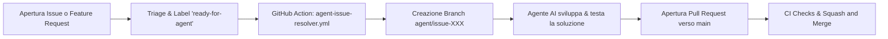

# Automazione degli Agenti e Risoluzione Automatica Issue

Questa guida spiega come è strutturata l'automazione per la risoluzione automatica di Issue e Feature Request tramite agenti AI in **agentic-coding-lab**.

---

## 1. Panoramica del Flusso di Lavoro

L'automazione si basa su un flusso semplice e controllato (Human-in-the-loop / Triage-driven):



1. **Apertura dell'Issue**: Uno sviluppatore o utente apre una segnalazione di bug o una feature request.
2. **Triage (`ready-for-agent`)**: Viene applicata l'etichetta `ready-for-agent` per indicare che la descrizione è chiara, completa e pronta per essere eseguita da un agente autonomo.
3. **Trigger GitHub Action**: Il workflow `.github/workflows/agent-issue-resolver.yml` intercetta l'evento, commenta la issue per confermare la presa in carico e predispone i requisiti per l'agente (es. tagging di `@copilot`, branch di destinazione `agent/issue-<numero>`).
4. **Sviluppo dell'Agente**: L'agente (Copilot Cloud Agent, Copilot CLI, Claude Code o script CI) legge il contesto, implementa il codice seguendo le skill (`skills/tdd/`, `skills/codebase-design/`) e verifica i test.
5. **Pull Request**: Viene aperta una PR intitolata con il riferimento all'issue (es. `feat: resolve issue #42 - Closes #42`).
6. **Squash & Merge**: Dopo la revisione e il passaggio dei check di CI, la PR viene fusa su `main` tramite **Squash and Merge**.

---

## 2. Configurazione Necessaria su GitHub (Step-by-Step per Principianti)

Per far funzionare correttamente l'automazione e le azioni GitHub:

### A. Permessi di GitHub Actions nel Repository

1. Vai su **Settings** del repository su GitHub.
2. Nel menu a sinistra, seleziona **Actions** $\rightarrow$ **General**.
3. Scorri fino a **Workflow permissions**:
   - Seleziona **Read and write permissions**.
   - Spunta la casella **Allow GitHub Actions to create and approve pull requests**.
4. Clicca su **Save**.

### B. Creazione dell'Etichetta `ready-for-agent`

1. Vai nella scheda **Issues** $\rightarrow$ **Labels**.
2. Se non esiste già, crea una nuova label:
   - **Name**: `ready-for-agent`
   - **Color**: `#0E8A16` (verde) o a scelta
   - **Description**: `Issue specificata e pronta per essere presa in carico da un agente AI`

### C. Impostazioni di Squash and Merge

1. Vai su **Settings** $\rightarrow$ **General**.
2. Scorri fino alla sezione **Pull Requests**:
   - Spunta solo **Allow squash merging**.
   - Deseleziona *Allow merge commits* e *Allow rebase merging*.
   - Abilita **Automatically delete head branches**.

---

## 3. Modalità di Esecuzione per gli Agenti

In base agli strumenti abilitati sul tuo account/organizzazione:

- **GitHub Copilot Coding Agent (Cloud / Web)**: Assegnando l'issue o menzionando `@copilot`, Copilot in GitHub avvia la sessione cloud per generare la soluzione e aprire la PR.
- **Agent CLI Locale (Copilot CLI / Claude Code)**: Lo sviluppatore può lanciare la CLI indicando il numero dell'issue:

  ```bash
  gh issue view <numero>
  git checkout -b agent/issue-<numero>
  # L'agente lavora, testa e crea la PR:
  gh pr create --fill
  ```

- **Custom Runner / CI Action**: Il workflow può essere esteso per richiamare direttamente uno script o un container AI automatizzato.
